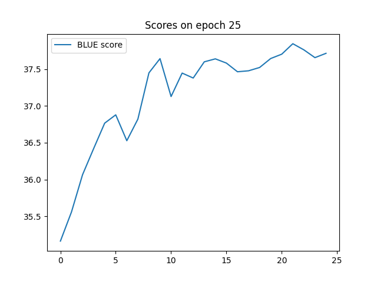

# Introduction
Text detoxification is a natural language processing task that involves cleaning or sanitizing text content to remove offensive, inappropriate, or harmful language. This task can be effectively addressed using various machine translation methods, which can automatically translate and replace problematic text with more suitable or neutral alternatives, making digital communication safer and more respectful.
Some of the methods that can be used to solve this task
* Encoder-Decoder Models: These are neural network architectures that consist of two main components - an encoder and a decoder. The encoder processes the input text, while the decoder generates the translated or modified output.
* BERT (Bidirectional Encoder Representations from Transformers): BERT is a pre-trained transformer model that can be fine-tuned for various NLP tasks. It understands context and can generate more contextually appropriate text.
* GPT (Generative Pre-trained Transformer): GPT models are autoregressive language models.
* BART (Bidirectional and Auto-Regressive Transformers): BART is another transformer model designed for various NLP tasks. It can paraphrase and rephrase sentences to make them more appropriate.
* RoBERTa (A Robustly Optimized BERT Pretraining Approach): RoBERTa is a variant of BERT that focuses on improving pre-training techniques.
# Data analysis
Initially I have found that some reference and translation pairs were mixed up. So I have fixed this by putting less toxic text in the reference column and putting more toxic text in the translation column.\
Then I have removed all rows with reference toxicity less that 0.99 and with translation toxicity more that 0.01.\
It is also important to keep similar text, so I have left only those rows with reference and translation similarity more that 0.7.\
After that I have removed texts that were too long. Tokenized everything with toxic words tokenizer and removed texts that had too many tokens. I have also removed texts those length difference was too different from tokens amount since it means that there are plenty weird symbols or characters that are not part of the tokenizer.\
This preprocessing pipeline has left me with about 100k words which is about 20% of the initial dataset size.
# Model Specification
For the final solution I have fine-tuned a BART (base) model trained on parallel detoxification dataset ParaDetox achiving SOTA results for detoxification task. BART is a transformer encoder-decoder (seq2seq) model with a bidirectional (BERT-like) encoder and an autoregressive (GPT-like) decoder. BART is pre-trained by corrupting text with an arbitrary noising function, and learning a model to reconstruct the original text.
# Training Process
I have trained the model using standard HuggingFace transformers pipeline
1. Loaded tokenizers with
```py
AutoTokenizer.from_pretrained('SkolkovoInstitute/bart-base-detox', model_max_length=MAX_LENGTH, cache_dir=f"../.cache/tokenizers/{model_name}")
```
2. Created arguments with
```py
Seq2SeqTrainingArguments(
    f"../models/{model_name}",
    evaluation_strategy = "steps",
    learning_rate=2e-5,
    per_device_train_batch_size=BATCH_SIZE,
    per_device_eval_batch_size=BATCH_SIZE,
    weight_decay=0.01,
    save_total_limit=1,
    num_train_epochs=10,
    predict_with_generate=True,
    fp16=True,
    save_steps=500,
    eval_steps=500,
    logging_steps=100,
)
```
3. Create data collator with
```py
DataCollatorForSeq2Seq(tokenizer, model=model)
```
4. Composed everything created about in
```py
Seq2SeqTrainer(
    model,
    args,
    train_dataset=tokenized_datasets["train"],
    eval_dataset=tokenized_datasets["validation"],
    data_collator=data_collator,
    tokenizer=tokenizer,
    compute_metrics=compute_metrics,
)
```
5. Trained trainer by calling `train()` method

# Evaluation
The evaluation consists of three types of metrics:
* style transfer accuracy (STA): percentage of nontoxic outputs identified by a style classifier.
* cosine similarity (SIM): between vectors of texts’ embeddings.
* fluency (FL): percentage of fluent sentences identified by a RoBERTa-based classifier of linguistic acceptability trained on the CoLA dataset.
# Results
This graph represents BLUE score during 25 training epochs.

Final metrics:
|Method   |STA↓   |Sim↑   |FL↑   |BLEU↑  |
|---|:---:|:---:|:---:|:---:|
|**Baselines**|
|Duplicate   |1.00   |0.80   |1.00   |1.00|
|Delete   |0.34   |0.77   |0.91   |0.83|
|**Encoder-decoder based**|
|Custom vocab   |**0.00**   |0.12   |0.21   |0.00   |
|Pretrained tokenizer   |**0.00**   |0.72   |0.35   |0.26   |
|**BARD Fine-tuning**|
|BARD base detox   |**0.00**   |**0.84**   |**0.92**   |**0.38**   |